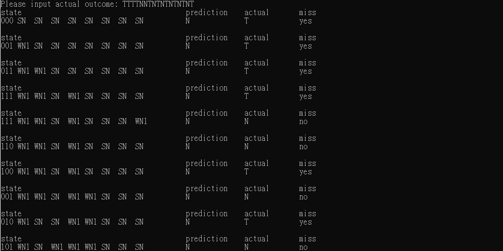
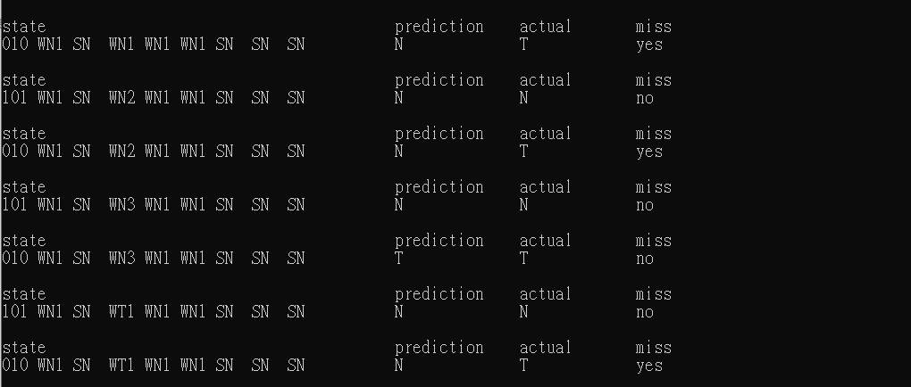

# ALCO_project2
## Introduction
  - You can see complete introduction in this [LINK](https://hackmd.io/@wycchen/1102ALCO_project2)
  - Write a 3-bit branch predictor that can predict task.
  - There are 8 states of 3-bit predictor, state changing as below picture.
  
  
## Documentation 
**1. Initial state as "000" and "SN"**

    string s;
    int n = 0;
    int t = 0;
    string st = "000";
    string state[8] = { "SN ","SN " ,"SN ","SN " ,"SN " ,"SN " ,"SN " ,"SN " };
          
**2. Print and input the task**

    cout << "Please input actual outcome: ";
	  cin >> s;
      
**3. Using character 'T' or 'N' to predict (means taken or not taken)**

    if (s[i] == 'T')
    
**4. According to above State diagram to change state**

   - `binToten` is a function that can help change string `st` from binary to decimal, and return integer
   - Below code is processed if actual outcome is "T"
   - If actual outcome is "N", code is similar. Just changing state by above State diagram
    
          if (state[binToten(st)] == "SN "){
            cout << setw(10) << "N " << setw(14) << "T " << setw(14) << "yes";
            state[binToten(st)] = "WN1";
          }
          else if (state[binToten(st)] == "WN1"){
            cout << setw(10) << "N " << setw(14) << "T " << setw(14) << "yes";
            state[binToten(st)] = "WN2";
          }
          else if (state[binToten(st)] == "WN2"){
            cout << setw(10) << "N " << setw(14) << "T " << setw(14) << "yes";
            state[binToten(st)] = "WN3";
          }
          else if (state[binToten(st)] == "WN3"){
            cout << setw(10) << "T " << setw(14) << "T " << setw(14) << "no ";
            state[binToten(st)] = "WT1";
          }
          else if (state[binToten(st)] == "WT1"){
            cout << setw(10) << "N " << setw(14) << "T " << setw(14) << "yes";
            state[binToten(st)] = "WT2";
          }
          else if (state[binToten(st)] == "WT2"){
            cout << setw(10) << "N " << setw(14) << "T " << setw(14) << "yes";
            state[binToten(st)] = "WT3";
          }
          else if (state[binToten(st)] == "WT3"){
            cout << setw(10) << "T " << setw(14) << "T " << setw(14) << "no ";
            state[binToten(st)] = "ST ";
          }
          else if (state[binToten(st)] == "ST "){
            cout << setw(10) << "N " << setw(14) << "T " << setw(14) << "yes";
            state[binToten(st)] = "ST ";
          }
 **5. Changing string `st` as history to record last 3 bit**
  - Using actual outcome is "T" as an example
  - "N" change char `a` to '0'
  
         char a = '1';
	     st.erase(0, 1);
	     st.push_back(a);
     
## Technique used
  - C++ -> programming language
  - Visual Studio -> devolopment environment

## Sample Output Screenshot

